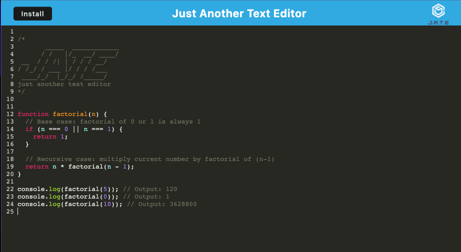

# WebWriter

## Description

WebWriter is a simple, lightweight, and fast text editor with a clean UI, built primarily with JavaScript, HTML/CSS, and powered by CodeMirror. It features a syntax-highlighting text editor implemented with CodeMirror. The goal of WebWriter is to provide a straightforward, no-frills text editing experience, making it perfect for quick note-taking or coding on the go.

## Technologies Used

- **JavaScript**
- **HTML/CSS**
- **CodeMirror**
- **Express**
- **Nodemon**
- **Babel**
- **Webpack**
- **Concurrently**

## Features

- JavaScript syntax highlighting
- Monokai color theme
- Line numbering
- Line wrapping
- Autosave feature storing the text in localStorage

### Installing

To install all the necessary packages, navigate to the project directory in your terminal and run the following command:

`npm run install`

To build the application for production, use the following command:

`npm run build`

To run the project::

`npm run start`

This will create a `dist` directory in the root of your project with the built files.

## Live Demo

WebWriter is deployed on Heroku and can be accessed [here](https://your-heroku-app-link/).

## Screenshot

_The screenshot may vary as the project evolves._
